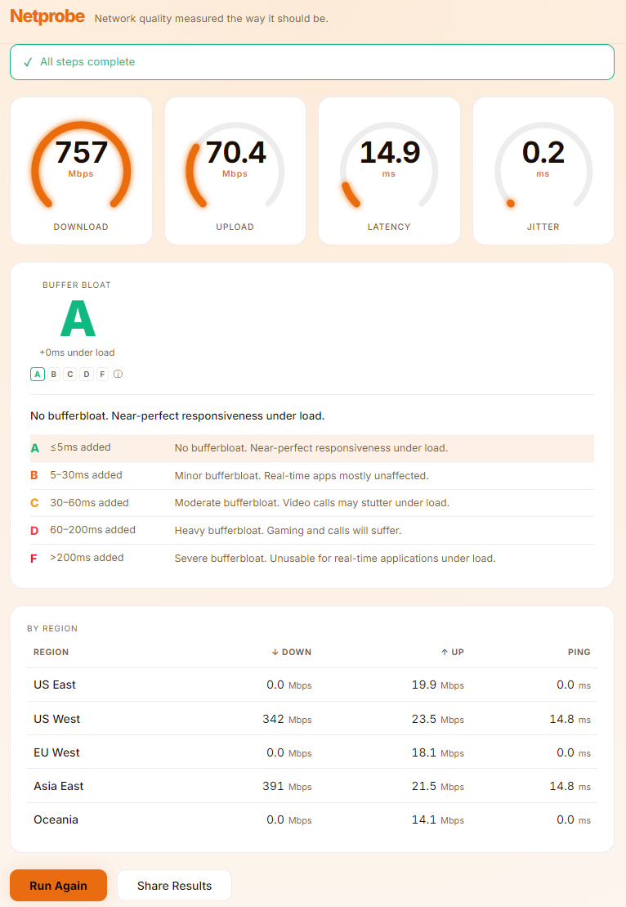

# Netprobe

Network quality measured the way it should be.

Netprobe runs a comprehensive connection test in your browser — no app, no server, no account. It measures what actually matters for a real internet connection: not just raw speed, but latency, jitter, and buffer bloat.

**Live:** https://rajeshsub.github.io/netprobe/



---

## What it measures

| Metric | What it tells you |
|---|---|
| **Download speed** | How fast data arrives at your device |
| **Upload speed** | How fast your device sends data |
| **Latency** | Round-trip time to your nearest server |
| **Jitter** | How consistent your latency is |
| **Buffer bloat** | Whether your connection gets sluggish under load — the hidden quality killer |

Buffer bloat is graded A–F. An A means your latency barely changes during a download. An F means your connection is unusable for calls, gaming, or anything interactive while someone else is downloading.

---

## How it works

1. Finds your nearest M-Lab server via the [NDT7 locate API](https://www.measurementlab.net/tests/ndt/ndt7/)
2. Runs a full download + upload test against that server (your headline speed)
3. Simultaneously fires HTTP pings during the download to measure buffer bloat in real time
4. Runs the same download + upload test in parallel against 5 fixed global regions (US East, US West, EU West, Asia East, Oceania)
5. Shows per-region results and an averaged headline

Everything runs in the browser. No data is sent to any server you don't choose to test against.

---

## Sharing results

When a test completes, the URL updates automatically. Copy and share it — the results are encoded directly in the hash fragment, so no server storage is involved. The recipient's browser reads the hash and renders the results locally.

---

## Development

```bash
npm install
npm run dev       # local dev server
npm test          # run tests
npm run build     # production build
```

Copy `.env.example` to `.env` before running locally. All configuration is via environment variables — no hardcoded URLs.

---

## Deployment

Pushes to `main` automatically build and deploy to GitHub Pages via GitHub Actions.

Before the first deploy, one step is needed in the repository settings:

1. **Settings → Pages → Source:** set to `GitHub Actions`

All config values have working defaults and no GitHub Variables need to be set.

---

## Stack

- [Svelte 5](https://svelte.dev/) + [Vite](https://vite.dev/) — compiled, no runtime framework overhead
- [M-Lab NDT7](https://www.measurementlab.net/) — open measurement infrastructure
- [uPlot](https://github.com/leeoniya/uPlot) — lightweight real-time charting
- [Vitest](https://vitest.dev/) — unit tests for all core logic modules
